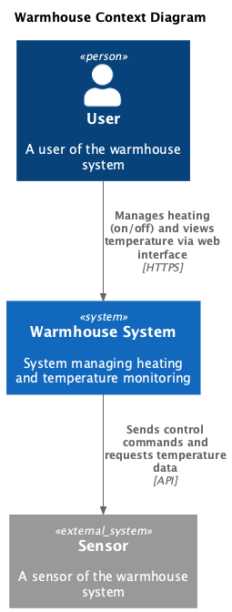
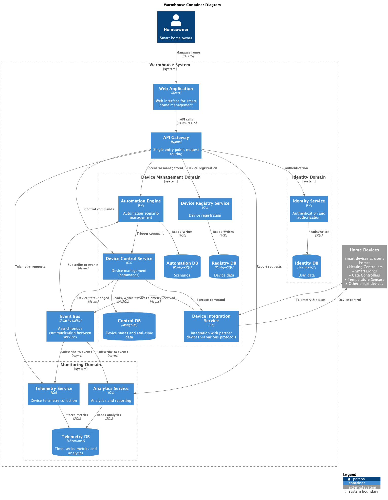
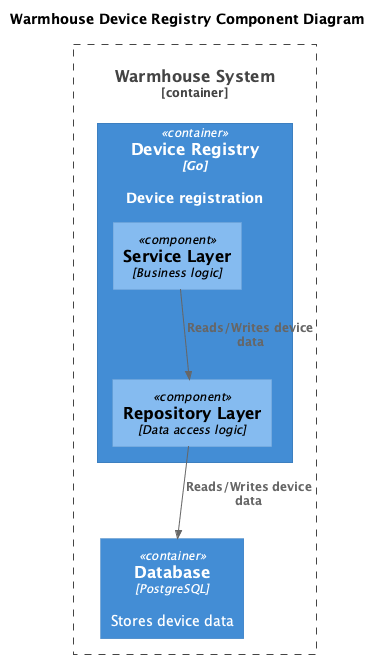
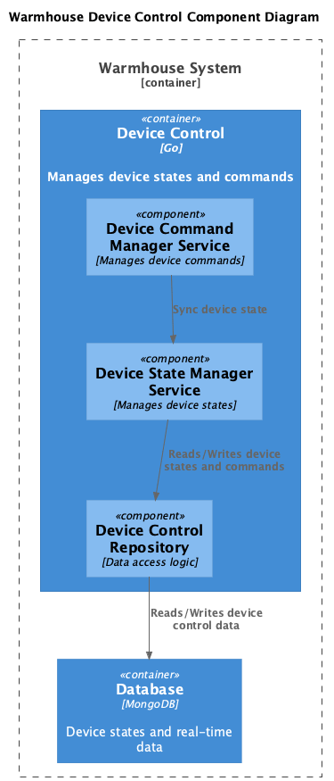
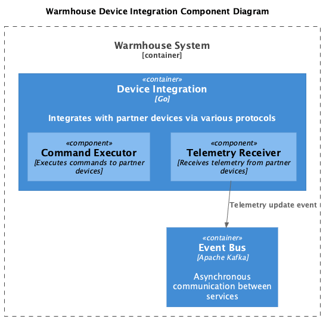
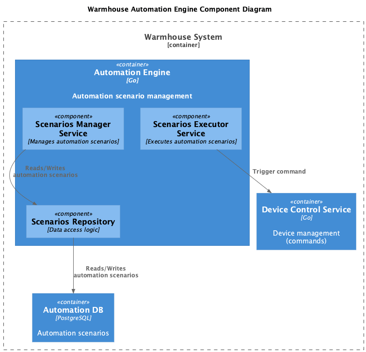
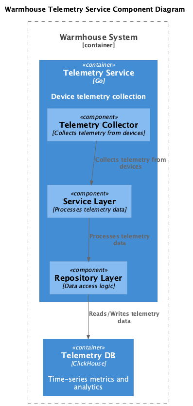
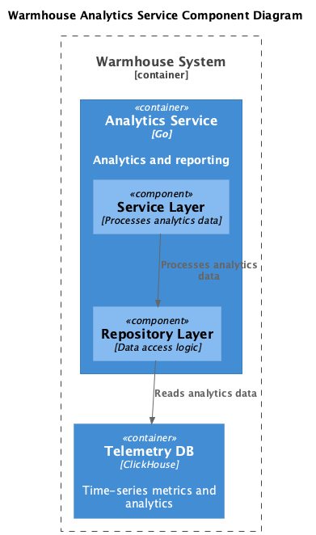
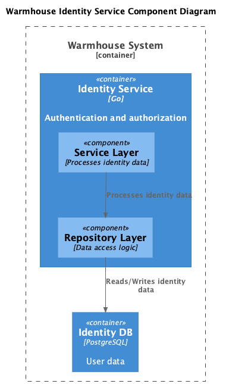
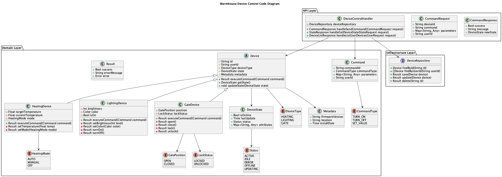

# Project_template

# Задание 1. Анализ и планирование

### 1. Описание функциональности монолитного приложения

**Управление отоплением:**

- Пользователи могут:
  - Управлять отоплением в доме
  - Проверять температуру
- Система поддерживает:
  - Удаленное управление

**Мониторинг температуры:**

- Пользователи могут:
  - Просматривать текущую температуру в своих домах через веб-интерфейс
- Система поддерживает:
  - Получение данных о температуре с датчиков, установленных в домах

### 2. Анализ архитектуры монолитного приложения

- Язык программирования: Go
- База данных: PostgreSQL
- Архитектура: Монолитная, все компоненты системы (обработка запросов, бизнес-логика, работа с данными) находятся в рамках одного приложения.
- Взаимодействие: Синхронное, запросы обрабатываются последовательно. Всё управление идёт от сервера к датчику. Данные о температуре также получаются через запрос от сервера к датчику.
- Масштабируемость: Ограничена, так как монолит сложно масштабировать по частям.
- Развертывание: Требует остановки всего приложения.

### 3. Определение доменов и границы контекстов

- Домен: управление устройствами
  - Поддомен управления датчиками
    - Контекст: регистрация датчиков
    - Контекст: включение/отключение отопления
    - Контекст: ведения журнала управления отоплением
  - Поддомен управления пользователями
    - Контекст: регистрация пользователей
- Домен: мониторинг температуры
  - Поддомен отслеживания температуры
    - Контекст: получение данных от датчиков
    - Контекст: ведение журнала изменения температуры
  - Поддомен отчётности и аналитики

### **4. Проблемы монолитного решения**

- Высокий риск ошибок.
- Трудно масштабировать отдельные компоненты системы.
- Длительные циклы разработки и развёртывания.
- Трудно управлять командой: задачи, которыми занимаются разные команды, могут блокировать друг друга.
- Развертывание требует остановки всего приложения.

### 5. Визуализация контекста системы — диаграмма С4



# Задание 2. Проектирование микросервисной архитектуры

**Диаграмма контейнеров**



**Диаграммы компонентов**

<details>
<summary>🔍 Показать диаграммы компонентов</summary>

### Device Registry Service



### Device Control Service



### Device Integration Service



### Automation Engine



### Telemetry Service



### Analytics Service



### Identity Service



</details>

**Диаграммы кода**

<details>
<summary>🔍 Показать диаграммы кода</summary>

### Device Control Service - Code Level



**Архитектурные слои:**

- **API Layer**: HTTP handlers, request/response DTOs
- **Domain Layer**: Device entities, бизнес-логика, value objects
- **Infrastructure Layer**: Репозитории, работа с MongoDB

</details>

# Задание 3. Разработка ER-диаграммы

Добавьте сюда ER-диаграмму. Она должна отражать ключевые сущности системы, их атрибуты и тип связей между ними.

# Задание 4. Создание и документирование API

### 1. Тип API

Укажите, какой тип API вы будете использовать для взаимодействия микросервисов. Объясните своё решение.

### 2. Документация API

Здесь приложите ссылки на документацию API для микросервисов, которые вы спроектировали в первой части проектной работы. Для документирования используйте Swagger/OpenAPI или AsyncAPI.

# Задание 5. Работа с docker и docker-compose

Перейдите в apps.

Там находится приложение-монолит для работы с датчиками температуры. В README.md описано как запустить решение.

Вам нужно:

1. сделать простое приложение temperature-api на любом удобном для вас языке программирования, которое при запросе /temperature?location= будет отдавать рандомное значение температуры.

Locations - название комнаты, sensorId - идентификатор названия комнаты

```
	// If no location is provided, use a default based on sensor ID
	if location == "" {
		switch sensorID {
		case "1":
			location = "Living Room"
		case "2":
			location = "Bedroom"
		case "3":
			location = "Kitchen"
		default:
			location = "Unknown"
		}
	}

	// If no sensor ID is provided, generate one based on location
	if sensorID == "" {
		switch location {
		case "Living Room":
			sensorID = "1"
		case "Bedroom":
			sensorID = "2"
		case "Kitchen":
			sensorID = "3"
		default:
			sensorID = "0"
		}
	}
```

2. Приложение следует упаковать в Docker и добавить в docker-compose. Порт по умолчанию должен быть 8081

3. Кроме того для smart_home приложения требуется база данных - добавьте в docker-compose файл настройки для запуска postgres с указанием скрипта инициализации ./smart_home/init.sql

Для проверки можно использовать Postman коллекцию smarthome-api.postman_collection.json и вызвать:

- Create Sensor
- Get All Sensors

Должно при каждом вызове отображаться разное значение температуры

Ревьюер будет проверять точно так же.

# **Задание 6. Разработка MVP**

Необходимо создать новые микросервисы и обеспечить их интеграции с существующим монолитом для плавного перехода к микросервисной архитектуре.

### **Что нужно сделать**

1. Создайте новые микросервисы для управления телеметрией и устройствами (с простейшей логикой), которые будут интегрированы с существующим монолитным приложением. Каждый микросервис на своем ООП языке.
2. Обеспечьте взаимодействие между микросервисами и монолитом (при желании с помощью брокера сообщений), чтобы постепенно перенести функциональность из монолита в микросервисы.

В результате у вас должны быть созданы Dockerfiles и docker-compose для запуска микросервисов.
